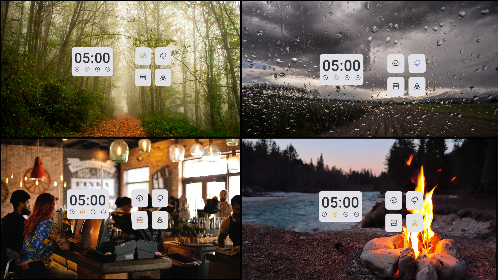

<h1 align="center"> Focus Timer 2.0 - Escolha o Ambiente que quer ouvir! </h1>

  * A aplicação é um temporizador com funções de iniciar e pausar, e a possibilidade de incrementar ou decrementar 5 minutos do contador pelo usuário, sendo o máximo 60min e o mínimo 0.
  
  * Contém sons nos botões e para avisar quando o contador zerar, além da opção de som de fundo, tendo as opções de som de lareira, chuva, floresta e cafeteria!

  * Link da aplicação: https://beatriz-gm.github.io/focusTimer2.0/

## Tecnologias utilizadas:
- Figma
- HTML
- CSS
- JavaScript

# By: [Beatriz Galvão](https://www.linkedin.com/in/beatriz-galmed/) ✨
